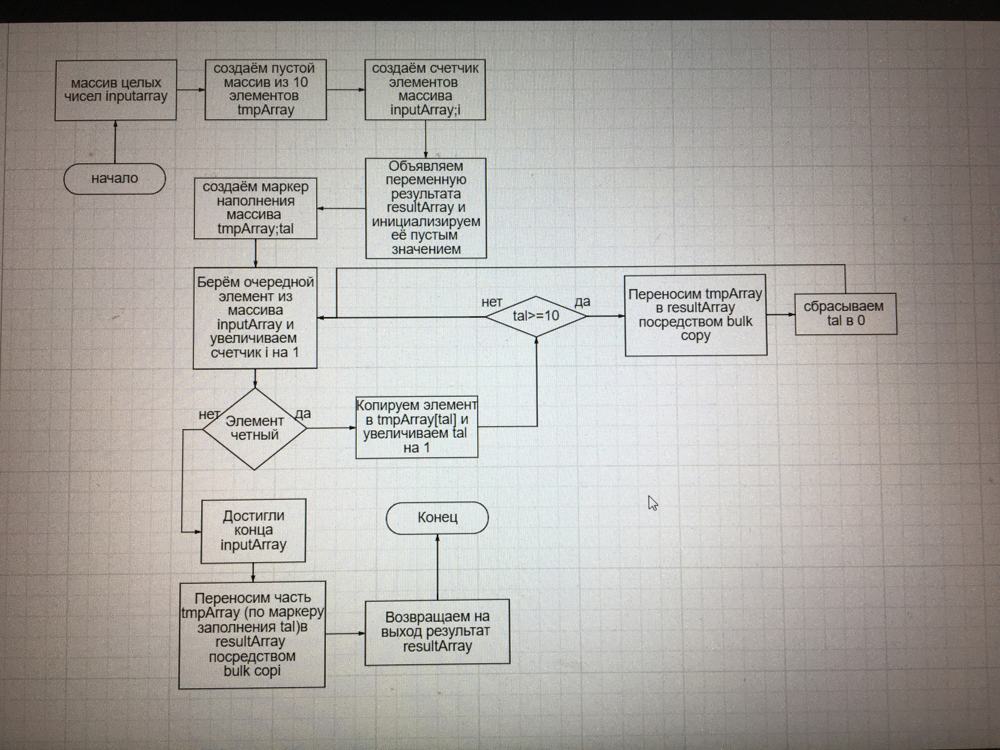

## Итоговая проверочная работа.
1. Создать репозиторий на GitHub.
2. Нарисовать блок-схему алгоритма (можно обойтись блок-схемой основной содержательной части, если вы выделяете ее в отдельный метод).
3. Снабдить репозиторий оформленным текстовым описанием решения (файл README.md).
4. Написать программу, решающую поставленную задачу.
5. Использовать контроль версий в работе над этим небольшим проектом (не должно быть так, что все залито одним комитом, как минимум этапы 2, 3 и 4 должны быть расположены в разных комитах).
### Описание решения

Программа решает задачу фильтрации массива целых чисел по критерию четности.

На вход подается массив целых чисел посредством ввода с клавиатуры. Кроме ручного ввода, предусмотрен тестовый режим с генерацией случайных чисел.

При запуске из консоли программа выводит приглашение с описанием работы.

Предусмотрено несколько команд:
 - Команда 1: начать ввод элементов массива
 - Команда 2: завершить ввод элементов массива и вывести результат
 - Команда 3: очистить массив
 - Команда 4: задать параметры генерации массива случайных чисел и вывести результат
 - Команда 5: выйти из приложения

Алгоритм функции фильтрации реализован при помощи промежуточного массива (ведерка), который накапливает четные числа и сливает результат в общий массив. При такой реализации, получается масштабируемый метод по потреблению памяти. Подобное поведение реализовано в стандартных коллекциях.

### Схема алгоритма функции filterEvens
.

### Код функции filterEvens
```C#
int[] filterEvens(int[] array)
{
    int[] result = { };
    int[] tmpArray = new int[10];
    int tal = 0;

    for (int i = 0; i < array.Length; i++)
    {
        if (array[i] % 2 != 0)
        {
            continue;
        }
        tmpArray[tal++] = array[i];
        if (tal >= tmpArray.Length)
        {
            int oldSize = result.Length;
            Array.Resize(ref result, oldSize + tal);
            Array.ConstrainedCopy(tmpArray, 0, result, oldSize, tal);
            tal = 0;
        }
    }

    if (tal > 0)
    {
        int oldSize = result.Length;
        Array.Resize(ref result, oldSize + tal);
        Array.ConstrainedCopy(tmpArray, 0, result, oldSize, tal);
    }

    return result;
}

Задача: Написать программу, которая из имеющегося массива строк формирует новый массив из строк, длина которых меньше, либо равна 3 символам. Первоначальный массив можно ввести с клавиатуры, либо задать на старте выполнения алгоритма. При решении не рекомендуется пользоваться коллекциями, лучше обойтись исключительно массивами.
Примеры:
[“Hello”, “2”, “world”, “:-)”] → [“2”, “:-)”]
[“1234”, “1567”, “-2”, “computer science”] → [“-2”]
[“Russia”, “Denmark”, “Kazan”] → []

string[] CreateArray()
{
    Console.Write("Введите размер массива: ");
    int size = Convert.ToInt32(Console.ReadLine());
    string[] array = new string[size];
    for (int i = 0; i < size; i += 1)
    {
        Console.Write($"Введите {i + 1} элемент массива: ");
        array[i] = Console.ReadLine();
    }
    return array;
}
void ShowArray(string[] array)
{
    for (int i = 0; i < array.Length; i += 1)
        Console.Write(array[i] + " ");
    Console.WriteLine();
}
string[] ResultArray(string[] array)
{
    int c = 0;
    int j = 0;
    for (int i = 0; i < array.Length; i += 1)
    {
        if (array[i].Length <= 3) c += 1;
    }
    string[] arrayRes = new string[c];
    for (int i = 0; i < array.Length; i += 1)
     {
        if (array[i].Length <= 3)
        {
            arrayRes[j] = array[i];
            j += 1;
        }
    }
    return arrayRes;
}
string[] arrayFaсt = CreateArray();
Console.WriteLine();
Console.WriteLine("Созданный массив:");
ShowArray(arrayFaсt);
Console.WriteLine();
string[] arrayRes = ResultArray(arrayFaсt);
Console.WriteLine("Новый массив из строк, длина которых меньше, либо равна 3 символам:");
ShowArray(arrayRes);
